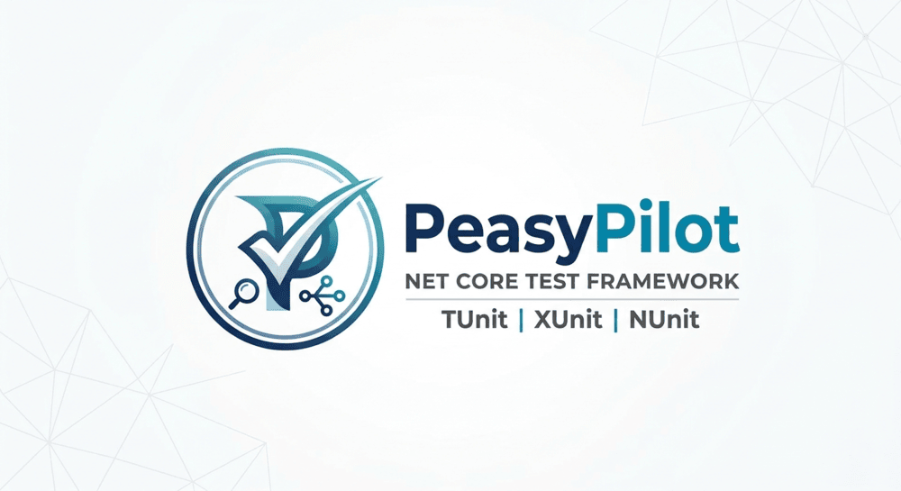

# PeasyPilot

A modular .NET testing framework for building, orchestrating, and running unit, integration, and BDD-style testing workflows with a consistent API.


[](https://www.nuget.org/packages/PeasyPilot.Unit)
[](https://www.nuget.org/packages/PeasyPilot.Unit)
[](https://dotnet.microsoft.com/)

## Overview

PeasyPilot is composed of focused packages that work together to provide a lightweight, extensible testing foundation for .NET projects.

### Included packages

- **PeasyPilot.Core** – core abstractions, test context, discovery, orchestration, reporting, and DI integration
- **PeasyPilot.CLI** – command-line runner for filtering and scheduling tests
- **PeasyPilot.Unit** – builder-oriented utilities and shared unit-test helpers
- **PeasyPilot.Integration** – integration testing support and fixtures
- **PeasyPilot.Bogus** – fake data generation via Bogus
- **PeasyPilot.Moq** – mock factory abstractions for Moq
- **PeasyPilot.BDD** – BDD-style feature and scenario model
- **PeasyPilot.TestAssistant** – intelligent test case generation and code scaffolding
- **PeasyPilot.Coverage** – coverage reporting support
- **PeasyPilot.XUnit** – xUnit base class integration
- **PeasyPilot.NUnit** – NUnit base class integration
- **PeasyPilot.TUnit** – TUnit base class integration

## Features

- Unified test context and execution pipeline
- Fluent assertions through `Assert.That(...)`
- Builder pattern support for test object creation
- Fake data generation with Bogus
- Mock creation abstractions with Moq
- xUnit, NUnit, and TUnit lifecycle integration
- **BDD support with Gherkin feature files**
- **Automatic step binding via reflection and pattern matching**
- **Feature file loading and scenario execution**
- **Parameter extraction from step text**
- **Singleton lifecycle management with IResettable**
- **Integration testing with database fixtures**
- **Intelligent test case generation (TestAssistant)**
- **Automatic scaffolding for xUnit, NUnit, and TUnit**
- CLI execution with filter and impact-analysis flags
- CI-friendly JSON and JUnit report output

## Installation

Add the core packages to your test project:

```bash
dotnet add package PeasyPilot.Core
dotnet add package PeasyPilot.Unit
```

For specific frameworks or tooling:

```bash
# xUnit support
dotnet add package PeasyPilot.XUnit

# NUnit support
dotnet add package PeasyPilot.NUnit

# TUnit support
dotnet add package PeasyPilot.TUnit

# Mocking
dotnet add package PeasyPilot.Moq

# Bogus data factory
dotnet add package PeasyPilot.Bogus

# BDD support
dotnet add package PeasyPilot.BDD

# Test case generation
dotnet add package PeasyPilot.TestAssistant
```

## Packaging & Distribution

### Quick Build & Pack

```bash
# Build and pack all projects
dotnet build -c Release
dotnet pack -c Release -o artifacts
```

### Automatic Watch Mode

Rebuild and repack NuGet packages automatically after source or configuration changes:

**PowerShell (Windows):**
```powershell
./scripts/version-watch.ps1
```

**Bash (Linux/Mac):**
```bash
./scripts/version-watch.sh
```

Generated packages are written to `artifacts/` and the watcher stops with `Ctrl+C`.

### Complete Guide

See **[PACKAGING.md](./docs/PACKAGING.md)** for:
- Build and pack workflows
- Watch script usage
- Multi-targeting verification
- Publishing to NuGet.org
- CI/CD integration
- Versioning strategy

## Quick start

### xUnit example

```csharp
using Xunit;
using PeasyPilot.XUnit;
using Assert = PeasyPilot.Core.Assertions.Assert;

public class CalculatorTests : PeasyPilotTestBase
{
    [Fact]
    public void Add_WithValidNumbers_ReturnsCorrectSum()
    {
        var calculator = new Calculator();

        var result = calculator.Add(2, 3);

        Assert.That(result)
            .IsEqualTo(5)
            .IsNotNull();
    }
}
```

### NUnit example

```csharp
using NUnit.Framework;
using PeasyPilot.NUnit;

public class UserServiceTests : PeasyPilotNUnitTestBase
{
    private UserService _service = null!;

    [SetUp]
    public override void Setup()
    {
        base.Setup();
        _service = new UserService();
    }

    [Test]
    public void GetUser_WithValidId_ReturnsUser()
    {
        var userId = 1;

        var user = _service.GetUser(userId);

        Assert.That(user, Is.Not.Null);
        Assert.That(user.Id, Is.EqualTo(userId));
    }
}
```

### TUnit example

```csharp
using PeasyPilot.TUnit;

public class SampleTests : PeasyPilotTUnitTestBase
{
    public async Task Example()
    {
        var value = 42;
        await Assert.That(value).IsEqualTo(42);
    }
}
```

### BDD example with step binding

**Feature file** (`features/user-registration.feature`):
```gherkin
Feature: User Registration
  Scenario: Register a new user
    Given a new user with email "john@example.com"
    When I submit the registration form
    Then the user should be registered successfully
```

**Step definitions** with automatic binding:
```csharp
using PeasyPilot.BDD.StepDefinitions;

public class UserRegistrationSteps : BddStepDefinition
{
    private string _userEmail = null!;
    private bool _registrationSucceeded;

    [Given("a new user with email {email}")]
    public async Task CreateUser(string email)
    {
        _userEmail = email;
        await Task.CompletedTask;
    }

    [When("I submit the registration form")]
    public async Task SubmitForm()
    {
        // Simulate form submission
        _registrationSucceeded = !string.IsNullOrEmpty(_userEmail);
        await Task.CompletedTask;
    }

    [Then("the user should be registered successfully")]
    public async Task VerifyRegistration()
    {
        await Task.CompletedTask;
        return _registrationSucceeded;
    }
}
```

**Test execution** with step binding resolver:
```csharp
using Xunit;
using PeasyPilot.BDD;
using PeasyPilot.BDD.Execution;
using PeasyPilot.BDD.FileLoading;
using PeasyPilot.BDD.StepDefinitions;

public class UserRegistrationBddTests
{
    [Fact]
    public async Task UserRegistration_LoadFeatureAndExecuteSteps()
    {
        // Load feature file
        var loader = new GherkinFeatureFileLoader();
        var feature = await loader.LoadFromFileAsync("features/user-registration.feature");

        // Setup step binding resolver
        var resolver = new StepBindingResolver();
        resolver.RegisterStepDefinition(typeof(UserRegistrationSteps));

        // Execute scenario with automatic step binding
        var executor = new ScenarioExecutor(resolver);
        var scenario = feature.Scenarios.First();
        var result = await executor.ExecuteAsync(scenario, serviceProvider: new ServiceCollection().BuildServiceProvider());

        Assert.True(result.Status == ScenarioStatus.Passed);
    }
}
```

### Test case generation with TestAssistant

**Intelligent scaffolding** for test cases. TestAssistant analyzes your types and generates test cases:

```csharp
using PeasyPilot.TestAssistant.Analysis;
using PeasyPilot.TestAssistant.Rendering;
using PeasyPilot.TestAssistant.Models;

// Your class to test
public class Calculator
{
    public Calculator(ILogger logger) { }
    public int Add(int a, int b) => a + b;
}

// Step 1: Analyze your type
var analyzer = new ReflectionTestScenarioAnalyzer();
var options = new TestBatteryAnalysisOptions
{
    TargetFramework = "xunit",
    MaxEnumCases = 10,
    IncludeBoundaryTests = true
};

var proposal = analyzer.Analyze(typeof(Calculator), options);

// Step 2: Render to framework-specific code
var registry = new TestBatteryRendererRegistry();
var renderer = registry.GetRenderer("xunit");
var renderOptions = new RenderOptions
{
    OutputNamespace = "MyApp.Tests"
};

string generatedCode = renderer.Render(proposal, renderOptions);

// Step 3: Write to file
File.WriteAllText("CalculatorTests.cs", generatedCode);
```

**Generated output:**
```csharp
using Xunit;
using PeasyPilot.XUnit;
using PeasyPilot.Moq;

namespace MyApp.Tests;

public class CalculatorTests : PeasyPilotTestBase
{
    private Calculator _subject = null!;

    public override void Setup()
    {
        base.Setup();
        var logger = new MockFactory().Create(typeof(ILogger));
        _subject = new Calculator(logger);
    }

    [Fact]
    public void Calculator_CanInstantiate()
    {
        // Nominal case: can instantiate the target type
        // TODO: Implement test
        Assert.NotNull(_subject);
    }

    [Fact]
    public void Add_HappyPath()
    {
        // Happy path for Add
        // TODO: Implement test
        Assert.NotNull(_subject);
    }
}
```

**Features:**
- Analyzes constructors, methods, and parameters via reflection
- Generates nominal (happy path) and boundary test cases
- Supports xUnit, NUnit, and TUnit renderers
- Smart parameter resolution (primitives, interfaces, concrete types)
- Extensible value generation rules

**For complete details**, see **[TEST_ASSISTANT_GUIDE.md](./docs/TEST_ASSISTANT_GUIDE.md)**.

### Test data generation

```csharp
using PeasyPilot.Bogus;

var dataFactory = new TestDataFactory();

var user = dataFactory.Create<User>();
var users = dataFactory.CreateMany<User>(5);
```

### Builder pattern

```csharp
using PeasyPilot.Unit.Builders;

public class UserBuilder : BuilderBase<User>
{
    public UserBuilder WithName(string name)
    {
        Instance.Name = name;
        return this;
    }

    public UserBuilder WithEmail(string email)
    {
        Instance.Email = email;
        return this;
    }
}

var user = new UserBuilder()
    .WithName("John Doe")
    .WithEmail("john@example.com")
    .Build();
```

### Mocking

```csharp
using PeasyPilot.Moq;

var mockFactory = new MockFactory();
var userRepository = mockFactory.Create(typeof(IUserRepository));
```

### Integration testing with fixtures

```csharp
using PeasyPilot.Integration.Fixtures;
using Xunit;

public class UserRepositoryIntegrationTests : XUnitIntegrationTestFixture
{
    protected override void ConfigureServices(IServiceCollection services)
    {
        var repository = new InMemoryUserRepository();
        services.AddSingleton<IUserRepository>(repository);
        
        // Register for automatic reset between tests
        RegisterResettableService(repository);
    }

    [Fact]
    public async Task AddUser_WithValidUser_Succeeds()
    {
        var repository = GetService<IUserRepository>();
        var user = new User { Name = "John Doe", Email = "john@example.com" };

        await repository.AddAsync(user);

        var users = await repository.GetAllAsync();
        Assert.Single(users);
    }

    [Fact]
    public async Task Reset_ClearsAllData()
    {
        var repository = GetService<IUserRepository>();
        await repository.AddAsync(new User { Name = "Jane" });

        // Reset database and services
        await ResetDatabaseAsync();

        var users = await repository.GetAllAsync();
        Assert.Empty(users);
    }
}
```

### Fluent assertions

```csharp
using PeasyPilot.Core.Assertions;

var result = Calculate(5, 3);

Assert.That(result)
    .IsEqualTo(8)
    .IsNotNull();
```

When the current test framework also exposes an `Assert` type, use the alias below to keep the PeasyPilot API accessible as `Assert.That(...)`:

```csharp
using Assert = PeasyPilot.Core.Assertions.Assert;
```

## BDD (Behavior-Driven Development)

PeasyPilot provides full Gherkin feature file support with automatic step binding resolution via reflection and pattern matching.

### Key features

- **Gherkin feature files**: Write scenarios in plain English
- **Step binding attributes**: `[Given]`, `[When]`, `[Then]`, `[And]`, `[But]`
- **Pattern matching**: Extract parameters from step text automatically
- **Reflection-based discovery**: Step definitions discovered at runtime
- **Parameter extraction**: Supports string, int, decimal, and custom types
- **Integration ready**: Works seamlessly with `IntegrationTestFixture` for database-backed scenarios

### Step binding patterns

```csharp
// Simple steps
[Given("the database is empty")]
public async Task DatabaseEmpty() { }

// Steps with single parameter
[Given("I have {count} items")]
public async Task HaveItems(string count) { }

// Steps with multiple parameters
[When("I create a user with email {email} and name {name}")]
public async Task CreateUser(string email, string name) { }

// Type conversion
[Given("I have {count} active users")]
public async Task HaveActiveUsers(int count) { }
```

### Full E2E example

See `samples/PeasyPilot.XUnit.Samples/` for complete working examples with:
- Feature files in `features/`
- Step definitions in `StepDefinitions/`
- Integration tests demonstrating E2E scenarios

## Dependency injection

Register PeasyPilot services in the container:

```csharp
services.AddPeasyPilotCore();
```

Or with custom options:

```csharp
services.AddPeasyPilotCore(options =>
{
    options.Environment = "Testing";
    options.EnableLogging = false;
});
```

The package also exposes a full pipeline registration helper:

```csharp
services.AddPeasyPilotPipeline();
```

## CLI usage

```bash
# Show help
peasypilot --help

# Run only matching tests
peasypilot --filter Customer

# Run impact analysis on a changed file set
peasypilot --changed-files CustomerService.cs,OrderService.cs

# Export JUnit XML results
peasypilot --format junit --output test-results.xml

# View execution history
peasypilot history
```

## Project structure

```text
src/
├── PeasyPilot.Core/          # core abstractions and orchestration
├── PeasyPilot.CLI/           # CLI runner
├── PeasyPilot.Unit/          # builders and helpers
├── PeasyPilot.Integration/   # integration fixtures
├── PeasyPilot.Bogus/         # fake data generation
├── PeasyPilot.Moq/           # mocking support
├── PeasyPilot.BDD/           # BDD model and execution
├── PeasyPilot.Coverage/      # coverage support
├── PeasyPilot.XUnit/         # xUnit adapter
├── PeasyPilot.NUnit/         # NUnit adapter
├── PeasyPilot.TUnit/         # TUnit adapter
└── Extensions/
    └── ...

tests/
└── PeasyPilot.Core.Tests/
```

## Target frameworks

- **.NET 8.0**
- **.NET 9.0**
- **.NET 10.0**

The repository is configured with multi-targeting in the project files and uses nullable reference types plus async-friendly testing patterns.

## Dependencies

- `Microsoft.Extensions.DependencyInjection`
- `Bogus` (for fake data generation)
- `Moq` (for mocking)
- `xUnit`, `NUnit`, and `TUnit` for test framework adapters
- ASP.NET Core testing support for integration scenarios

## Contributing

Contributions are welcome. Areas of interest include:

- additional framework adapters
- coverage improvements
- helper utilities and assertions
- CLI enhancements
- documentation and sample projects

## License

PeasyPilot is distributed under the MIT license.

## Documentation

Complete guides for each PeasyPilot package. Each guide is available in **English** and **French**.

### Foundation

- **[PeasyPilot-Core](./docs/PeasyPilot-Core.md)** ([🇫🇷 FR](./docs/PeasyPilot-Core-FR.md))
  Core abstractions, test discovery, orchestration, reporting, DI integration

### Framework Adapters

- **[PeasyPilot-XUnit](./docs/PeasyPilot-XUnit.md)** ([🇫🇷 FR](./docs/PeasyPilot-XUnit-FR.md))
  xUnit integration with base classes
- **[PeasyPilot-NUnit](./docs/PeasyPilot-NUnit.md)** ([🇫🇷 FR](./docs/PeasyPilot-NUnit-FR.md))
  NUnit integration with base classes
- **[PeasyPilot-TUnit](./docs/PeasyPilot-TUnit.md)** ([🇫🇷 FR](./docs/PeasyPilot-TUnit-FR.md))
  TUnit integration with async support

### Testing Patterns

- **[PeasyPilot-Unit](./docs/PeasyPilot-Unit.md)** ([🇫🇷 FR](./docs/PeasyPilot-Unit-FR.md))
  Builder patterns and test utilities
- **[PeasyPilot-Integration](./docs/PeasyPilot-Integration.md)** ([🇫🇷 FR](./docs/PeasyPilot-Integration-FR.md))
  Integration testing with fixtures and database management
- **[PeasyPilot-BDD](./docs/PeasyPilot-BDD.md)** ([🇫🇷 FR](./docs/PeasyPilot-BDD-FR.md))
  Behavior-driven testing with Gherkin and step binding

### Test Generation & Tools

- **[PeasyPilot-TestAssistant](./docs/PeasyPilot-TestAssistant.md)** ([🇫🇷 FR](./docs/PeasyPilot-TestAssistant-FR.md))
  Intelligent test case generation and code scaffolding
- **[PeasyPilot-Bogus](./docs/PeasyPilot-Bogus.md)** ([🇫🇷 FR](./docs/PeasyPilot-Bogus-FR.md))
  Fake data generation
- **[PeasyPilot-Moq](./docs/PeasyPilot-Moq.md)** ([🇫🇷 FR](./docs/PeasyPilot-Moq-FR.md))
  Mock factory abstractions

### CLI & Reporting

- **[PeasyPilot-CLI](./docs/PeasyPilot-CLI.md)** ([🇫🇷 FR](./docs/PeasyPilot-CLI-FR.md))
  Command-line runner with filtering and scheduling
- **[PeasyPilot-Coverage](./docs/PeasyPilot-Coverage.md)** ([🇫🇷 FR](./docs/PeasyPilot-Coverage-FR.md))
  Coverage reporting and analysis

### Build & Deployment

- **[Packaging Guide](./docs/PACKAGING.md)**
  Build, pack, and publish NuGet packages

### Samples

Working examples in `samples/`:
- `PeasyPilot.XUnit.Samples/` — xUnit with BDD and integration tests
  - Feature files: `features/users.feature`, `features/orders.feature`
  - Step definitions: `StepDefinitions/UserSteps.cs`, `StepDefinitions/OrderSteps.cs`
  - Tests: `Tests/UserBddTests.cs`, `Tests/OrderBddTests.cs`

## Version

Current package version: **0.1.4**
